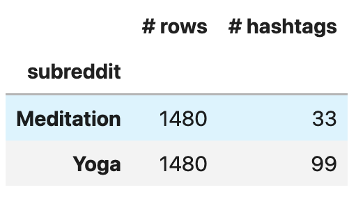

#  Project 3 - Reddit

### Problem Statement

Q: How do we tailor the __wellness package (program)__ to the company employees?

Given a corpus of data made from the monthly survey submissions of the employees, we would like to tailor the company's wellness program to each employee based on their personality type and character. The assumption is that Yoga and Meditation attract different personality types.

We would like to develop a model that would work on text inputs of the employees and would recommend either Yoga or Meditation. In order to develop this model, we studied the corpus from two subreddits on topics of Yoga and Meditation. Different classification models were trained and tested on our data.

The success of the model is evaluated based on the accuracy of the classification. Since we are not focusing on minimizing either the type 1 or type 2 errors, accuracy would be an appropriate measure of the goodness of our model.

If our model does well according to our evaluation metrics, this would be a useful tool for the companies that care for their employees and would like their employees to feel heard and understood.


  
### Contents:
- [Problem Statement](#Problem-Statement)
- [Data Import & Cleaning](#Data-Import-and-Cleaning)
- [Tables](#Tables)
- [Data Visualizations](#Visualize-the-Data)
- [Conclusions & Recommendations](#Conclusions-Recommendations)
- [Required Installations](#Required-Installations)


### Data Import & Cleaning


#### Original Data

4,000 posts were extracted from Yoga and Meditation subreddits each. After removing the empty posts and removed posts, we were left with 1480 posts per each subreddit.

The links to the subreddits:

- https://www.reddit.com/r/yoga/
- https://www.reddit.com/r/Meditation/

Please refer to [notebook](./code/01_Fetch_Clean_Data.ipynb).

#### Data Cleaning

Part of the data cleaning is done in preprocessing step [here](./code/02_Modeling.ipynb).


### Modeling

Please refer to this [notebook](./code/02_Modeling.ipynb).


### sources

- wordcloud
    - https://png-clipart.blogspot.com/2011/03/clip-art-student-tree.html
    - https://github.com/amueller/word_cloud
    - https://github.com/amueller/word_cloud/blob/master/examples/masked.py

- hashtags
    - https://stackoverflow.com/questions/54761797/how-to-preserve-hashtag-and-mention-characterizers-from-countvectorizer-token
- msc
    - https://www.studytonight.com/post/scikitlearn-countvectorizer-in-nlp


### Tables





### Data Visualizations


<details>
    <summary markdown="span">More plots</summary>
 

    

    
For more plots, please refer to the [presentation slides.](./presentation/Project_3_presentation_Azin.pdf)
    
</details>


### Conclusions & Recommendations
   
Based on the results of our modeling on the subreddit corpus for Yoga and Meditation, the _Multinomial Naive Bayes classification model_ on  _TF-IDF Vectorized_ data produced the best accuracy (88% compared to 50% baseline) amongst other trained models. We believe that this shows that there is some perceptible difference between the Yoga and Meditation practitioners.

We would recommend the companies to provide monthly questionaires to the employees asking them about their leisure activities or providing them with personality tests and then training our model on their sample text and come up with appropriate recommendations for their wellness programmes.


### Required Installations


```
conda install -c conda-forge wordcloud     # for wordcloud
```

